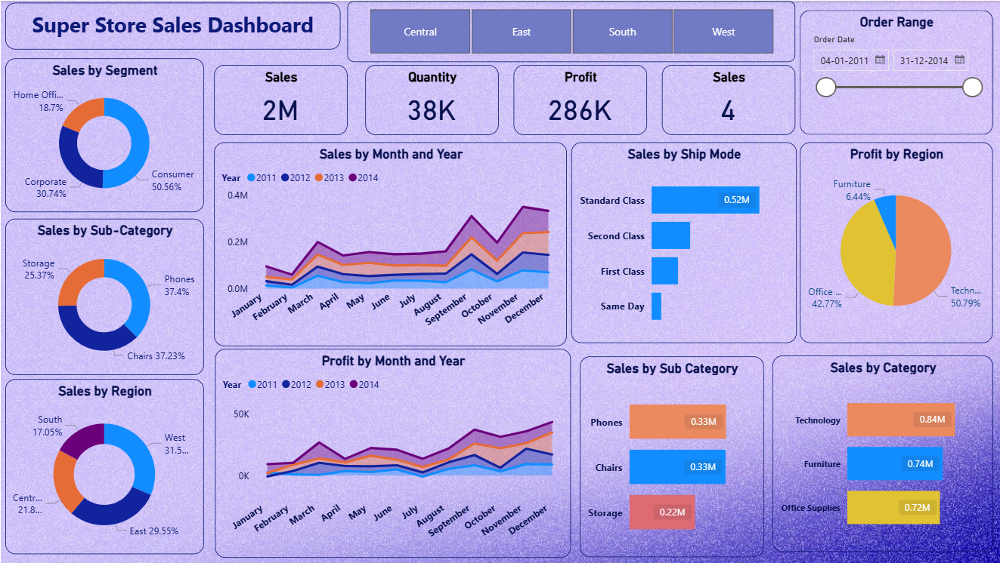
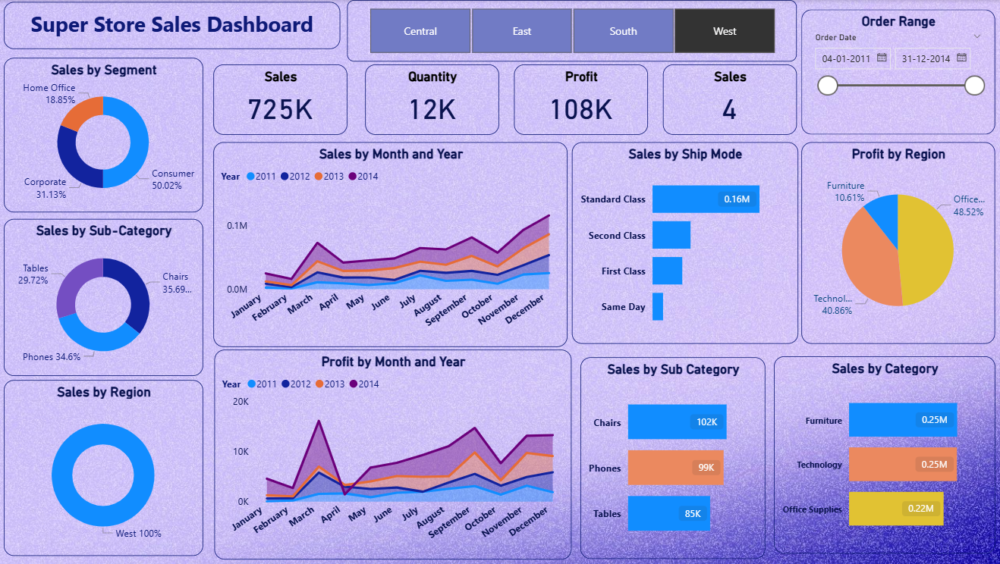
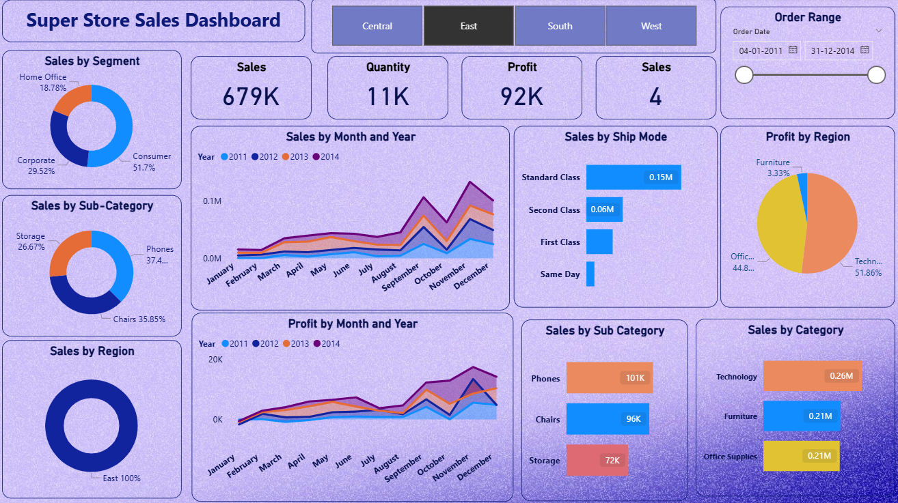
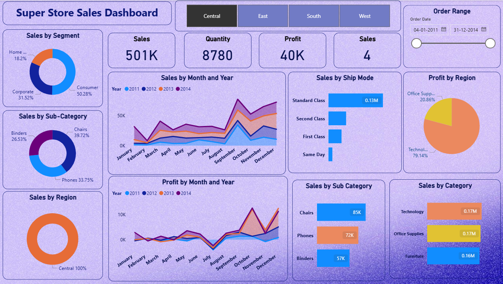
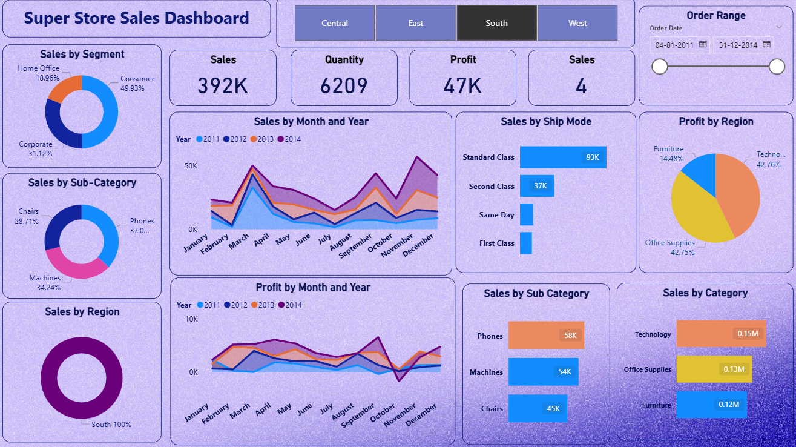

# 🛒 Super Store Global Sales & Profit Intelligence

## 📌 Project Overview
An end-to-end data visualization solution built in **Power BI** to analyze 4 years of retail performance (2011-2014). This dashboard transforms raw transactional data into interactive insights to help stakeholders track growth and profitability.

### 📊 Master Dashboard

---

## 🕹️ Interactive Regional Deep-Dive
The dashboard features dynamic regional slicers that allow for granular analysis of each territory:

| **West Region** | **East Region** |
| :---: | :---: |
|  |  |

| **Central Region** | **South Region** |
| :---: | :---: |
|  |  |

---

## 📈 Key Business Insights

* **The Q4 Surge:** Sales consistently peak in **November and December**, showing a clear seasonal trend across all 4 years.
* **Profitability Leaders:** The **Technology** category is the most profitable, contributing over **50%** of total profit despite having similar sales volume to Furniture.
* **Operational Trends:** **Standard Class** is the most preferred shipping method, used for over **$0.52M$** in orders.

---

## 🛠️ Technical Workflow
1.  **Data Extraction:** Sourced from the `Superstore.xlsx` dataset.
2.  **ETL:** Cleaned, filtered, and formatted data using **Power Query**.
3.  **Modeling:** Built a high-performance Star Schema for efficient filtering.
4.  **DAX:** Developed custom measures for **Profit Margin %**, **Total Sales**, and **YoY Growth**.

---

## 📂 Repository Contents
* `sales_dashboard.pbix`: The interactive Power BI report.
* `Superstore.xlsx`: The source dataset.
* `*.png`: Dashboard screenshots used for documentation.

---

**Developed by [P. Punith Kumar]** *Passionate about data storytelling and business intelligence.*
